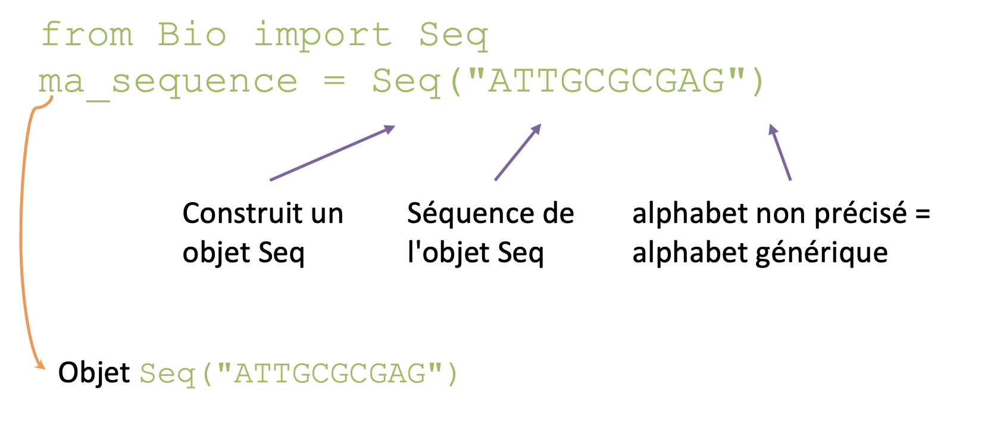

Librairie contenant un ensemble d'objets et de fonctions dédiés à la manipulation des données de biologie moléculaire  

* `Lecture et écriture` de fichiers (fasta/q, genbank…)
* `Interrogation` directe des `bases de données` (NCBI…)
* `Lancement` simplifié `d'outils` usuels (Blast, Clustal…)

Importer les objets Biopython :  

```python
from Bio.Seq import Seq, SeqRecord	    # Objets Séquence
from Bio import SeqIO					# Entrée Sortie Séquence
from Bio import AlignIO					# Entrée/Sortie Alignements
```

## Séquences

Objet `Seq` : __séquence__ (suite de bases) + __alphabet__

L'alphabet définit le type de la séquence : ADN, Protéine, ARN... 

```python
from Bio import Seq
ma_sequence = Seq("ATTGCGCGAG")
```

{: style="height:200px;width:500px"}

Parfois utile de spécifier l'alphabet :  
`DNAAlphabet()`, `ProteinAlphabet()`, `RNAAlphabet()`

```python
from Bio.Seq import Seq
from Bio.Alphabet import ProteinAlphabet
ma_sequence = Seq("ACGHA", ProteinAlphabet())
```

L'object `Seq` se comporte comme une __chaîne de caractères__  (= liste non modifiable)

* Ajout avec `+`  
    ```python
    ma_sequence = ma_sequence + "TATATA"
    ```

* Test d'appartenance avec `in`
    ```python
    if "ATG" in ma_sequence
    ```
    Au début et à la fin
    ```python
    if ma_sequence.startswith("ATG")
    if ma_sequence.endswith("TAA")
    ```

* Accès aux bases avec [ ] (index à partir de 0 !)
    ```python
    print(ma_sequence[0])
    ```

* Longueur
    ```python
    len(ma_sequence)
    ```

* Position d'une sous-chaîne
    ```python
    pos = ma_sequence.find("ATG")
    ```

* Nombre d'occurrences d'un élément (sans superpositions)
    ```python
    nombre_a = ma_sequence.count("A")
    ```

`Seq` fournit aussi des fonctions spécifiques :  

* Complément inverse
    ```python
    rev_compl = ma_sequence.reverse_complement()
    ```

* Traduction
    ```python
    ma_proteine = ma_seq.translate()
    ```

## SeqRecord

Objet `SeqRecord` : `Seq` + identifiants + description + informations optionnelles (annotations et features)

```python
from Bio.SeqRecord import SeqRecord
```

Attributs :  

* `.seq` : objet `Seq`
* `.id` : identifiant
* `.name` : nom commun, par ex. accession
* `.description` : la description
* `.letter_annotations` : dictionnaire des annotations par lettre (qualités…)
* `.annotations` : dictionnaire des annotations (keywords, comments…)
* `.features` : liste de SeqFeature
* `.dbxrefs` : cross-références aux bases de données

```python
from Bio.Seq import Seq
from Bio.SeqRecord import SeqRecord
mon_record = SeqRecord(Seq("ATAGC"), id="mySeq", description="test")
mon_record.name = "maSeq"
```

## SeqIO

`SeqIO` : Ensemble de fonctions pour la __lecture et écriture__ de séquences sous différents formats (fasta/q, GenBank, EMBL…)

```python
from Bio import SeqIO
```

Les fonctions de `SeqIO` retournent des objets `SeqRecord`

### Lecture

* Lire un fichier avec __UNE__ séquence : 

    ```python 
    SeqIO.read(chemin/objet fichier, format)
    ```

    ```python
    from Bio import SeqIO
    mon_record = SeqIO.read("seq.fasta", "fasta")
    ```

    Renvoie un `SeqRecord`

* Lire un fichier avec __PLUSIEURS__ séquences :  

    ```python
    SeqIO.parse(chemin/objet fichier, format)
    ```

    Renvoie un itérateur de `SeqRecord`

    ```python
    from Bio import SeqIO
    records = SeqIO.parse(chemin/objet fichier, format)
    for mon_record in records:
        print(mon_record.id)
    ```

    !!! Warning
        attention : on ne peut parcourir l'itérateur qu'une seule fois

    Récupérer toutes les séquences dans une liste :  
    ```python
    liste_records = list(SeqIO.parse(chemin, format)
    ```

    Récupérer toutes les séquences dans un __dictionnaire dont__ les clés sont les id des SeqRecord :  
    ```python
    dico_records = SeqIO.to_dict(SeqIO.parse(chemin, format))
    ```

### Ecriture

Obtenir une séquence dans un format choisi à partir d'un `SeqRecord` :  

```python
record.format(format)
```

Écrire un `SeqRecord` dans un fichier :  

```python
fd.write(record.format("fasta"))
```

Écrire un ensemble de `SeqRecord` dans un fichier :  

```python
SeqIO.write(liste_seqrecords, chemin, format)
```

### Conversion

__Convertir des séquences d'un format à un autre__ directement

```python
SeqIO.convert(chemin_in, format_in, chemin_out, format_out)
```

(Renvoie le nombre de séquences converties)

--8<-- "pages/pratiques/pratique8.md"