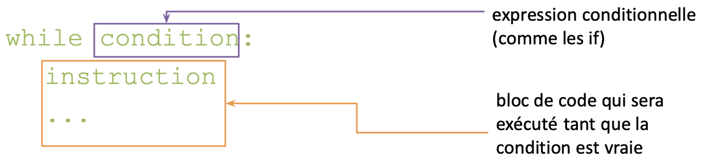
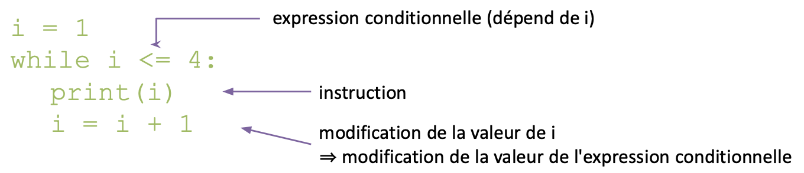
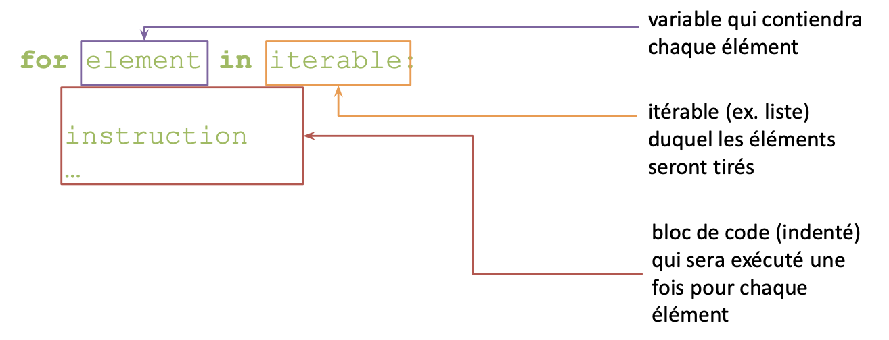
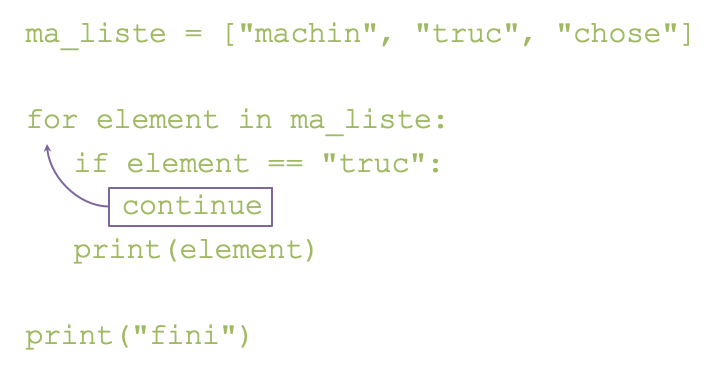
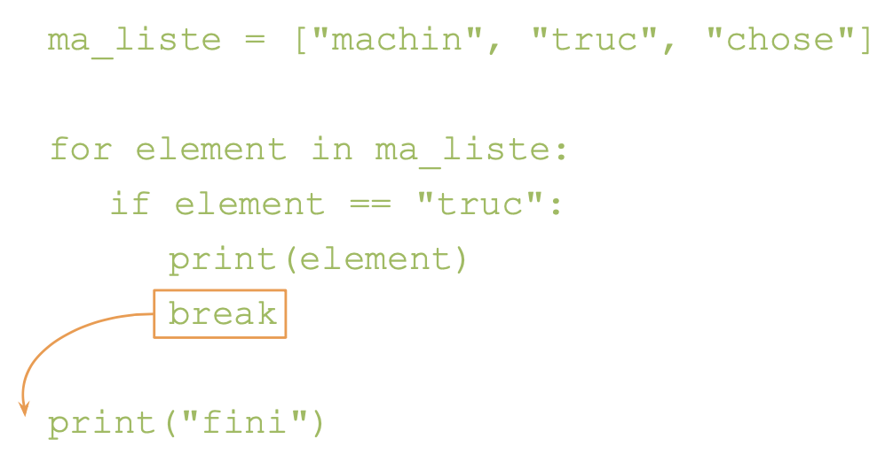

On peut avoir besoin de répéter une action (un bloc de code) plusieurs fois

Exemples:
* Afficher chaque élément d'une liste
* Tant que vous n'aurez pas compris les boucles, je rééexpliquerai

Pour cela on va "__boucler__".

Deux structure itératives : __Pour__ (`for`) et __Tant que__ (`while`)

## while (TANT QUE)

__Tant que__ la condition est vraie, le bloc de code est exécuté

{: style="height:150px;width:600px"}

!!! warning
    Le bloc d'instructions doit __modifier la valeur de l'expression conditionnelle__, sinon boucle infinie !
    (rappel : `CTRL+C` pour arrêter un programme bloqué dans une boucle infinie)

{: style="height:140px;width:600px"}

## for (POUR)

__Pour chaque élément__ d'un itérable, exécuter un bloc de code
(une liste est un exemple d'itérable)

{: style="height:200px;width:600px"}

```python
animaux = ["Lion", "Chèvre", "Vache"]
for animal in animaux:
	print(animal)
```

!!! tip
    Astuce : avoir en même temps la position et la valeur de l'élément
    ```python
    for position, element in enumerate(iterable):
    	print(f"Position {position} : {element}")
    ```

!!! warning
    Ne pas modifier la liste sur laquelle on boucle !

### range 

Si on veut itérer sur un nombre croissant, on peut utiliser `range` :

```python
range(fin)              # Entiers de 0 à fin - 1
range(début, fin)       # Entiers de début à fin - 1
range(début, fin, pas)	# Entiers de début à fin - 1 tous les pas
```

!!! Exemple 
    nombres pairs entre 2 et 12 : 
    ```python
    for i in range(2, 14, 2):
    	print(i)
    ```

### interuptions

Deux instructions qui permettent d'__interrompre une boucle prématurément__ :


* `continue` arrête l'exécution de l'itération en cours et `passe à l'itération suivante`  
=> utile si on veut ignorer une variable particulière et passer directement à la suivante

{: style="height:300px;width:600px"}

* `break` arrête l'exécution de l'itération en cours et __sort de la boucle__
=> utile par exemple si on cherche quelque chose et qu'on l'a trouvé

{: style="height:300;width:600px"}