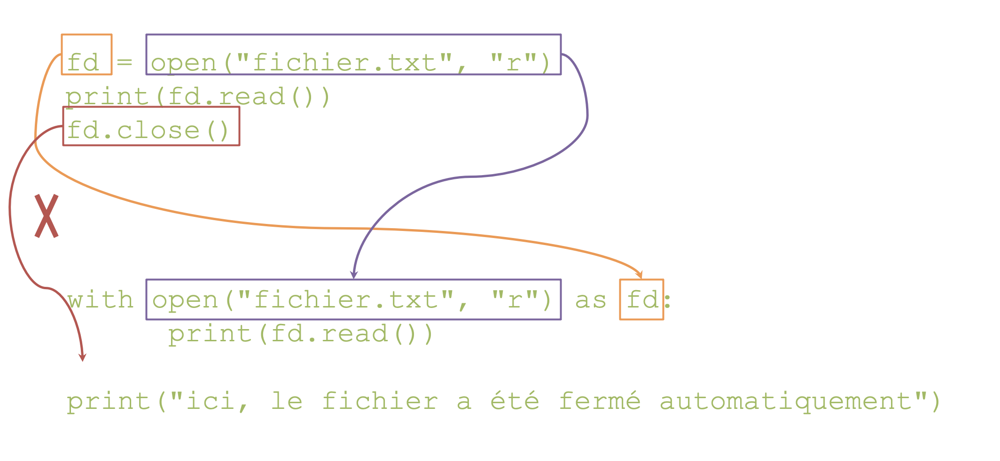

# Fichiers

Souvent en bioinfo, on doit lire ou écrire des fichiers

Ouvrir un fichier :  

```python
fd = open("nom_du_fichier", "mode d'ouverture")
```

Modes d'ouverture :  

* `r` pour lecture
* `w` pour écriture, écrase le fichier si il existe déjà
* `a` pour écriture, ajoute à la fin du fichier si il existe déjà
* `x` pour écriture, échoue si le fichier existe déjà

Python traite les fichiers comme des fichiers texte par défaut (encodage utf-8)

`fd` est un objet représentant le fichier ouvert sur lequel on peut appeler des fonctions pour manipuler le fichier.

Une fois les manipulations finies, on doit impérativement __fermer le fichier__ !

```python
fd = open("fichier.txt", "r")
# ici instructions utilisant le fichier…
fd.close()
# ici on ne peut plus utiliser fd
```

## Lecture

__Lecture__ du fichier (fichier ouvert en mode `r`)  
Le fichier a un curseur qui avance à chaque opération de lecture.  

Lire tout le fichier comme chaîne de caractères
    ```python
    chaine = fd.read()
    ```

Lire n caractères du fichier comme chaîne de caractères
    ```python
    chaine = fd.read(n)
    ```

Lire une ligne du fichier comme chaîne de caractères
    ```python
    ligne = fd.readline()
    ```

Lire toutes les lignes du fichier dans une liste
    ```python
    lignes = fd.readlines()
    ```

Pour revenir au début : `fd.seek(0)`

Lire le fichier __ligne par ligne__ avec une __boucle__ (Équivalent d'une boucle utilisant `fd.readline()`)

```python
for ligne in fd:
	print(ligne)
```

La boucle utilise le curseur du fichier de la même manière que les autres fonctions !

!!! Warning 
    Les lignes lues par `readline()`, `readlines()` et la boucle `for` contiennent les sauts de ligne (`\n`). 

## Ecriture

__Écriture__ dans un fichier (fichier ouvert en mode `w`, `a` ou `x`)

* Écrire une chaîne de caractères : 

    ```python 
    fd.write(chaine)
    ```

    !!! warning
        N'ajoute pas automatiquement le saut de ligne ("\n")

* Écrire plusieurs lignes (liste de chaînes de caractère) : 

    ```python
    fd.writelines(liste)
    ```

    !!! warning
        N'ajoute pas non plus les sauts de ligne ("\n")

## With

Ouverture du fichier avec `with` : __fermeture automatique__  

{: style="height:250px;width:500px"}

Fichier fermé automatiquement :  

* A la fin du bloc
* En cas d'erreur dans le bloc

