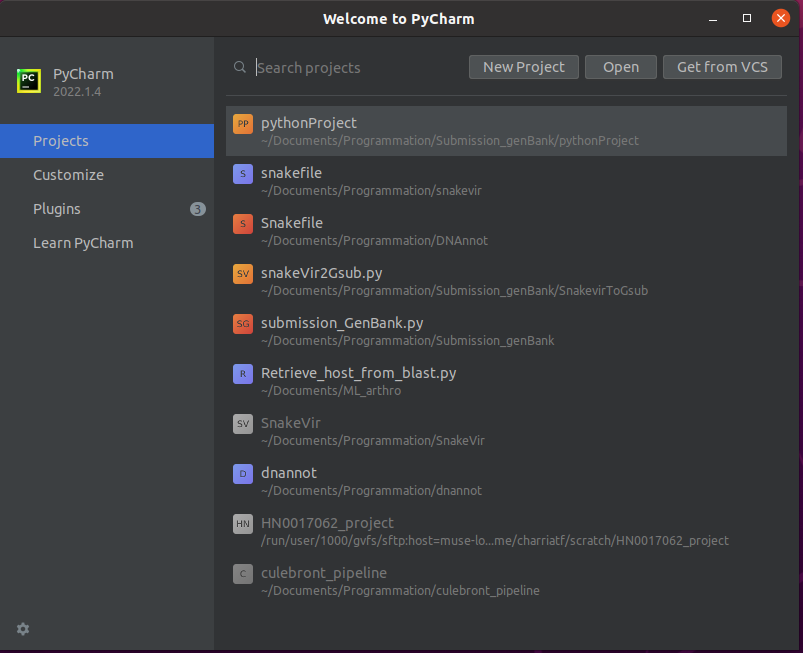
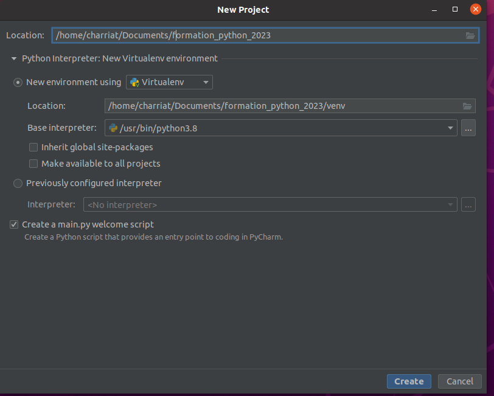
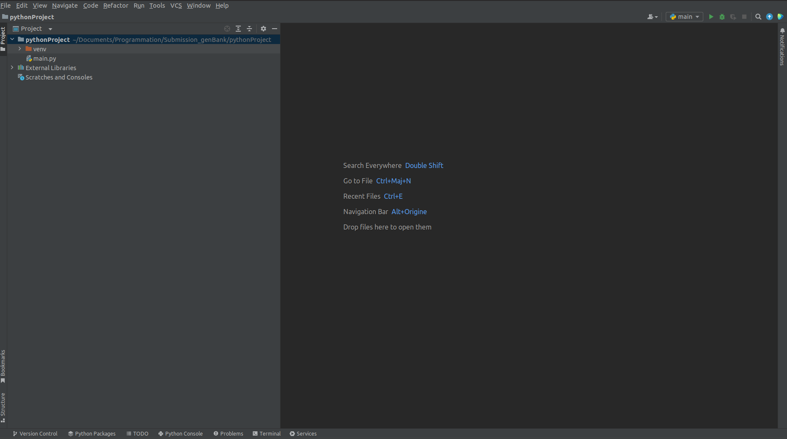

## Introduction 

<iframe id="iframepdf" src="../../lectures/python_introduction.pdf" frameborder="0" width="640" height="480" allowfullscreen="true" mozallowfullscreen="true" webkitallowfullscreen="true"></iframe> 

## Pourquoi programmer en Python ?

### Qu'est\-ce qu'un programme ou un script ?

* Une    _suite d'instruction_  que l'ordinateur doit exécuter

* => programmer = décrire à l'ordinateur très clairement tout ce qu'il doit faire

* Un programme est décrit par un  _algorithme_  \(= suite d'instructions\)

### Pourquoi apprendre à programmer ?

* Faire travailler l'ordinateur à notre place \(calculs\)

* _Automatiser / enchaîner_  des traitements \(proposés par des outils existant\)

* Effectuer des tâches qu'aucun outils existant ne propose

### Pourquoi en Python ?

* Un des langages le plus utilisés en  _bioinformatique_  car adéquat pour réaliser des scripts\, portables sur Unix/Mac et sur Windows

* Syntaxe du langage incite à la clarté

* Langage interprété = programme traduit au fur et à mesure par un  _interpréteur_  afin d’être exécutée par l’ordinateur

* Langage orienté objet\, moderne\, haut niveau

* =>  _Biopython_  : ensemble de fonctions et procédures conçues pour le     traitement et l'analyse de données biologiques

Référence : http://python\.developpez\.com/tutoriels/cours\-python\-uni\-paris7/

## Premiers pas

* _Mode interactif_  \(REPL\)  
Exécution d’instructions simples, retour en direct  
Le plus souvent utilisé :  __ipython__   \(interpréteur amélioré\)

  
Sortir de l'interpréteur avec la commande quit\(\) / exit\(\) ou Ctrl\+d

* _Mode programmation / script_   
exécution d'une suite d'instructions plus complexes écrites à l'avance  
Écrire les instructions dans un fichier  _script\_python_  _\.py_    \( _\#_    pour les commentaires\)  
Exécuter le script :
  * Soit avec la commande :  _python3 script\_python\.py_
  * Soit en rendant le fichier  _script\_python\.py_    «  exécutable  » \(qui doit l'interpréter\):
    * Ajouter en 1er ligne du fichier _\#\!/usr/bin/env python3_
    * Changer les droits du fichier _chmod \+x script\_python\.py_
    * Lancer la commande :    _\./script\_python\.py_

## Utilisation de nano pour éditer des fichiers

nano :  _éditeur de fichier_  simple en ligne de commande\.Installé sur toutes les machines Linux\.

nano unfichier\.py pour  _éditer un fichier existant_  ou  _créer un nouveau fichier_

_Sauvegarder et quitter_  : CTRL\-X \-> O \-> Entrée

\(les raccourcis sont affichés en bas de l'écran\)

Chez vous\, vous voudrez probablement utiliser un éditeur plus complet \(vim\, VS Code\, Sublime Text…\) ou un IDE \( __P__  __yCharm__ \, Spyder\)

## PyCharm

### Avantage de PyCharm pour éditer des fichiers python

PyCharm :  _environnement de développement intégré \(IDE\)_  Utilisable sur Windows\, Linux et Mac

Utilise  _l'auto complétion du code_

_gère l’indentation du code_

Affiche des messages si erreur de syntaxe\, propose les importations de librairie\, analyse en temps réel du code\, …

### Utiliser Python avec PyCharm

Télécharger PyCharm :  _[https://www\.jetbrains\.com/fr\-fr/pycharm/download/\#section=linux](https://www.jetbrains.com/fr-fr/pycharm/download/#section=linux)_

Créer un nouveau projet \(ex : formation\_python\_2023 \)

_Mode interactif_  \(REPL\)Exécution d’instructions simples\, retour en direct

Pour ce cours : utiliser  _PyCharm_  _ _

_  _  \(interpréteur amélioré\)

