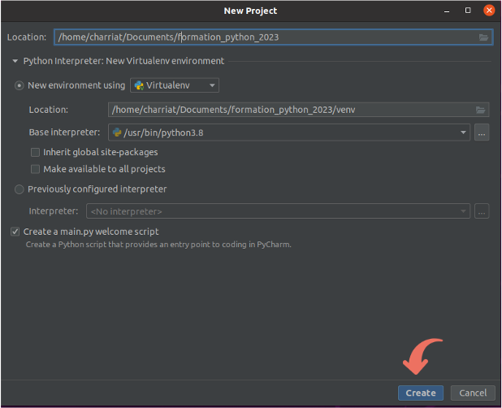

## Introduction 

<iframe id="iframepdf" src="../../lectures/python_introduction.pdf" frameborder="0" width="640" height="480" allowfullscreen="true" mozallowfullscreen="true" webkitallowfullscreen="true"></iframe> 

## Pourquoi programmer en Python ?

### Qu'est-ce qu'un programme ou un script ?

* Une __suite d'instruction__  que l'ordinateur doit exécuter

* => programmer = décrire à l'ordinateur très clairement tout ce qu'il doit faire

* Un programme est décrit par un  __algorithme__ (= suite d'instructions)

### Pourquoi apprendre à programmer ?

* Faire travailler l'ordinateur à notre place (calculs)

* __Automatiser / enchaîner__  des traitements (proposés par des outils existant)

* Effectuer des tâches qu'aucun outils existant ne propose

### Pourquoi en Python ?

* Un des langages le plus utilisés en  __bioinformatique__  car adéquat pour réaliser des scripts, portables sur Unix/Mac et sur Windows

* Syntaxe du langage incite à la clarté

* Langage interprété = programme traduit au fur et à mesure par un __interpréteur__  afin d’être exécutée par l’ordinateur

* Langage orienté objet, moderne, haut niveau  
  =>  __Biopython__  : ensemble de fonctions et procédures conçues pour le traitement et l'analyse de données biologiques

Référence : http://python\.developpez\.com/tutoriels/cours\-python\-uni\-paris7/

## Premiers pas

### Mode interactif  (REPL)  
Exécution d’instructions simples, retour en direct  
Le plus souvent utilisé :  <span style="color:green">__ipython__ </span>  \(interpréteur amélioré\)

  
<span style="color:#000000">Sortir de l'interpréteur avec la commande quit\(\) / exit\(\) ou Ctrl\+d</span>


### Mode programmation / script  
exécution d'une suite d'instructions plus complexes écrites à l'avance 

* Écrire les instructions dans un fichier  `script_python.py` ( `#` pour les commentaires)  
* Exécuter le script :
    * Soit avec la commande :  `python3 script_python.py`
    * Soit en rendant le fichier `script_python.py` «  __exécutable__  » (qui doit l'interpréter):  
        * Ajouter en 1er ligne du fichier 
        ```python
        #!/usr/bin/env python3
        ```
        * Changer les droits du fichier 
        ```python
        chmod +x script_python.py
        ```
        * Lancer la commande 
        ```python
        ./script_python.py
        ```


## Utilisation de nano pour éditer des fichiers

nano :  __éditeur de fichier__  simple en ligne de commande. Installé sur toutes les machines Linux.

`nano unfichier.py` pour  __éditer un fichier existant__  ou  __créer un nouveau fichier__

__Sauvegarder et quitter__  : CTRL\-X \-> O \-> Entrée  

!!! note
    Dans `nano` les raccourcis sont affichés en bas de l'écran

Chez vous, vous voudrez probablement utiliser un éditeur plus complet (`vim`, `VS Code`, `Sublime Text`, …) ou un IDE ( __`PyCharm`__, `Spyder`).

## PyCharm

### Avantage de PyCharm pour éditer des fichiers python

* __environnement de développement intégré (IDE)__  Utilisable sur Windows, Linux et Mac

* Utilise  __l'auto complétion du code__

* __gère l’indentation du code__

* Affiche des messages si erreur de syntaxe, propose les importations de librairie, analyse en temps réel du code, …

### Utiliser Python avec PyCharm

* Télécharger PyCharm :  _[https://www\.jetbrains\.com/fr\-fr/pycharm/download/\#section=linux](https://www.jetbrains.com/fr-fr/pycharm/download/#section=linux)_

* Créer un nouveau projet (ex : formation_python)

{: style="height:500px;width:600px"}
{: style="height:500px;width:600px"}

* __Mode interactif__  (REPL)
Exécution d’instructions simples, retour en direct

{: style="height:400px;width:600px"}
