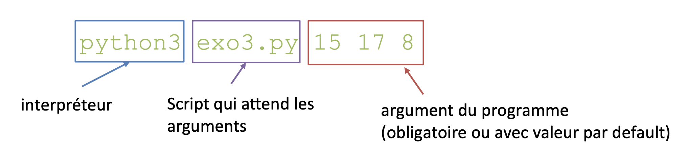

#### Passage d'arguments

Exemples

```python
note1 = input("Donner une note : ")
note2 = input("Donner une note : ")
note3 = input("Donner une note : ")
moy = (int(note1)+int(note3)+int(note2))/3
print ("La moyenne est ",moy)
```

On souhaite passer les valeurs `note1`, `note2`, `note3` en argument au programme


Exemples

```python
liste_animaux = ['vache','souris','levure','bacterie']
for nom in listeAnimaux:
print(nom)
```

On souhaite passer `liste_animaux` en argument au programme

Jusqu'à présent, on utilise des données fixes ou demandées à l'utilisateur avec `input()`.

On veut passer des __arguments/paramètres__ au programme :  

* pour permettre l'exécution du programme avec __différentes données__ sans avoir à modifier le script
* pour __éviter l'interaction avec l'utilisateur__

{: style="height:130px;width:600px"}

Récupérer les valeurs passées en argument au programme :  
Utilisation de la liste `sys.argv` du module sys (`import sys`)

* `sys.argv[0]` ⇒ nom du programme
* `sys.argv[1]...sys.argv[n]` ⇒ valeurs des arguments

Exemple pour la commande `python exo3.py 15 17 8` :

* `sys.argv[0]` est égal à "exo3.py"
* `sys.argv[1]` est égal à "15"
* `sys.argv[2]` est égal à "17"
* `sys.argv[3]` est égal à "8"

Vérifier qu'on a le __bon nombre d'arguments__ = taille de `sys.argv`

Si on a 3 arguments, alors `len(sys.argv) == 4`

Si on a pas le bon nombre, quitter le programme :
```python
sys.exit()
```
sortie normale  
```python
sys.exit("Message d'erreur")
```
sortie avec erreur (met le code d'erreur du shell à 1)


--8<-- "pages/pratiques/pratique5.md"