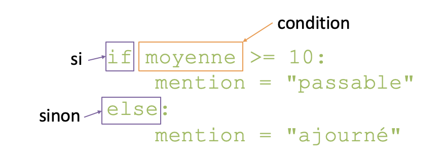
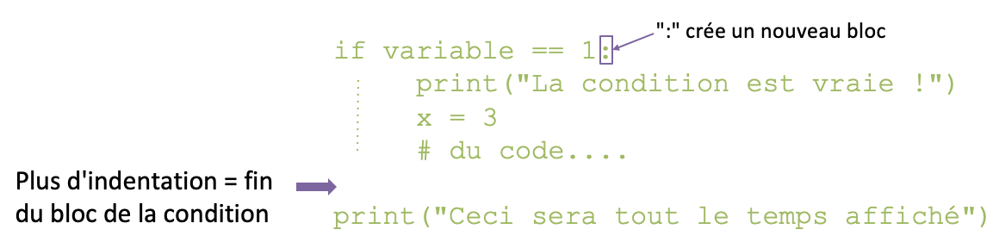
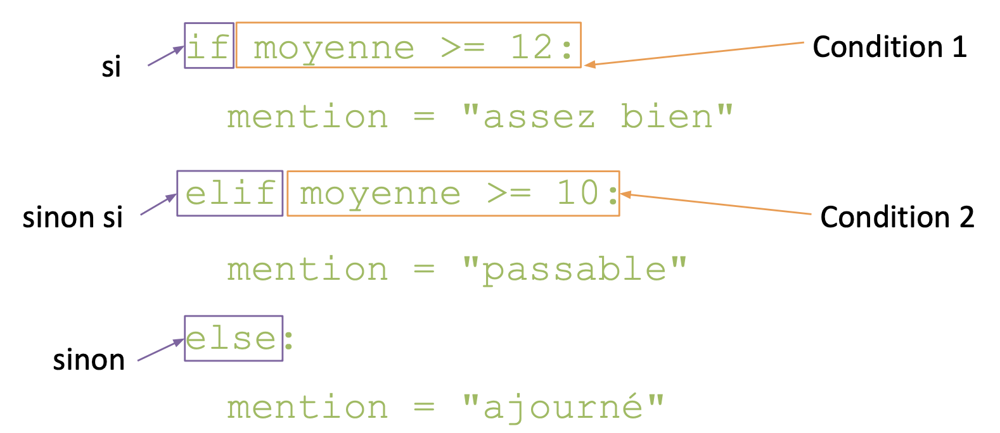

## Structures conditionnelles

Permet d'exécuter du code différent en fonction du résultat d'une ou plusieurs conditions/tests

{: style="height:130px;width:400px"}

## Indentation en Python

Contrairement à la plupart des autres langages, les __Blocs de code__ (conditions, boucles, fonctions…) sont définis par __l'indentation__

{: style="height:150px;width:600px"}

Convention : Indenter avec __4 espaces__ (pas de tabulations)


## Structures conditionnelles

{: style="height:220px;width:600px"}

### Tests

#### Opérateurs de comparaison

* `==`		égal à
* `!=`		différent de
* `>`		strictement supérieur à
* `>=`		supérieur ou égal à
* `<`		strictement inférieur à
* `<=`		inférieur ou égal à
* `is`		est le même objet que (utiliser pour vérification de type)

```python
x = 3
if type(x) is int:
```

!!! warning
    Ne pas confondre :  
    `=`	opérateur d'assignation  
    et  
    `==`	opérateur de comparaison

#### Opérateurs logiques

Les opérateurs de comparaisons renvoient un  __booléen__ (`bool`)

On peut combiner plusieurs conditions avec les  __opérateurs logiques__

* `and`	ET
* `or`	OU (inclusif)
* `not`	NON


{: style="height:200px;width:200px"}

```python
age = 32
if age >= 4 and age <= 99:
	print("Vous pouvez jouer aux legos")
```

| Test | Result |
| :-: | :-: |
| True and True | True |
| True and False | False |
| False and True | False |
| False and False | False 

| Test | Result |
| :-: | :-: |
| True or True | True |
| True or False | True |
| False or True | True |
| False or False | False |

| Test | Result |
| :-: | :-: |
| not True | False |
| not False | True |

--8<-- "pages/pratiques/pratique2.md"