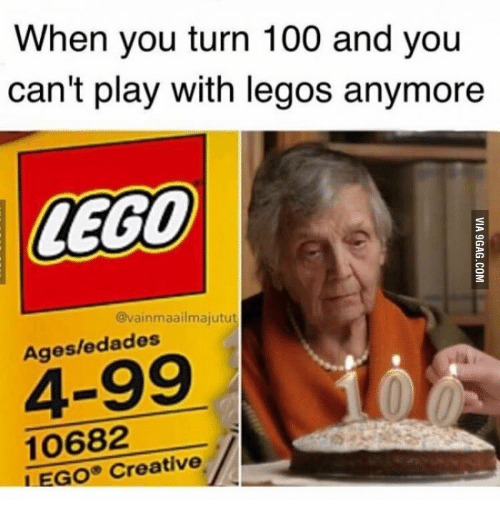

## Structures conditionnelles

Permet d'exécuter du code différent en fonction du résultat d'une ou plusieurs conditions/tests

_if moyenne >= 10:_  _	mention = "passable"_  _else:_  _	mention = "ajourné"_

## Indentation en Python

Contrairement à la plupart des autres langages\,   les  _ Blocs de code_  \(conditions\, boucles\, fonctions…\) définis par l' _indentation_

":" crée un nouveau bloc

_if variable == 1:_  _	print\("La condition est vraie \!"\)_  _	x = 3_  _	\# du code\.\.\.\._  _print\("Ceci sera tout le temps affiché"\)_

Plus d'indentation = fin du bloc de la condition

__Convention : Indenter avec __  _4 espaces_  __ \(pas de tabulations\)__

## Structures conditionnelles

_if moyenne >= 12:_  _	mention = "assez bien"_

_elif moyenne >= 10:_

_mention = "passable"_  _else:_  _	mention = "ajourné"_

## Structures conditionnelles > Tests

_Opérateurs de comparaison_

_==_ 		égal à _\!=_ 		différent de _>_ 		strictement supérieur à _>=_ 		supérieur ou égal à _<_ 		strictement inférieur à _<=_ 		inférieur ou égal à

_is_ 		est le même objet que \(utiliser pour vérification de type\)

_x = 3_  _if type\(x\) is int:_

 __Attention \!__ 

Ne pas confondre :

_=_  	opérateur d'assignation

et

_==_  	opérateur de comparaison

## Structures conditionnelles > Opérateurs logiques

Les opérateurs de comparaisons renvoient un  _booléen_  \(bool\)

On peut combiner plusieurs conditions avec les  _opérateurs logiques_

_and_  _	_  ET  _or_  _		_  OU \(inclusif\)  _not_  _	_  NON

| True and True | True |
| :-: | :-: |
| True and False | False |
| False and True | False |
| False and False | False |

| True or True | True |
| :-: | :-: |
| True or False | True |
| False or True | True |
| False or False | False |

_age = 32_

_if age >= 4 and age <= 99:_

_	print\("Vous pouvez jouer aux legos"\)_

| not True | False |
| :-: | :-: |
| not False | True |